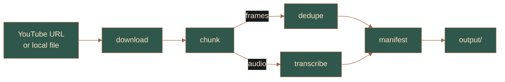

<p align="center">
  
</p>

<p align="center">
  <a href="https://opensource.org/licenses/MIT"></a>
  <a href="https://go.dev"></a>
  <a href="https://github.com/spf13/cobra"></a>
  
  
  
</p>

Turn a YouTube video into an ordered set of **(frame, audio transcript, timestamp)** chunks on disk, so a coding agent can later "watch" the video in the correct order and reconstruct exactly what appeared on screen — code, prompts, configs — without jumbling the sequence.

Small, local-first CLI. No cloud APIs, no GPU: everything after the video download runs fully offline on CPU.

## Install

Requires `yt-dlp`, `ffmpeg` ≥ 6.0, and [`whisper-cli`](https://github.com/ggml-org/whisper.cpp) with a ggml model — the tool checks for them at startup and fails with a clear message if missing; it never installs them. Default model: `~/.cache/ytreconstruct/whisper/ggml-small-q8_0.bin` (override with `--model`).

```sh
go build -o bin/ytreconstruct ./cmd/ytreconstruct
```

## Usage

```sh
ytreconstruct all <url>                     # full pipeline (recommended)
ytreconstruct all <url> --skip-transcribe   # frames + manifest only
ytreconstruct all <url> --jobs 4            # cap parallelism
ytreconstruct all --file video.mp4          # offline: local file instead of URL

# individual stages (useful for resuming or iterating)
ytreconstruct download <url>
ytreconstruct chunk <video_id>
ytreconstruct dedupe <video_id>
ytreconstruct transcribe <video_id>
ytreconstruct manifest <video_id>
```

`--work-dir`, `--output-dir`, and `--jobs` are persistent flags on every subcommand (defaults: `work`, `output`, half the CPU count). See `ytreconstruct <cmd> --help` for the full flag list.

| Flag | Applies to | Default | Meaning |
|---|---|---|---|
| `--skip-transcribe` | all | false | skip the transcription stage |
| `--file` | all, download | — | use a local video file instead of a URL |
| `--scene-threshold` | all, chunk | 0.4 | scene-change threshold, 0..1 (higher = fewer cuts) |
| `--hash-threshold` | all, dedupe | 5 | max dHash Hamming distance to treat frames as identical |
| `--model` | all, transcribe | `~/.cache/ytreconstruct/whisper/ggml-small-q8_0.bin` | whisper model path |
| `--language` | all, transcribe | auto | whisper language hint (e.g. `ja`; never whisper-cli's English default) |

### Output

`output/<video_id>/manifest.json` is the strict, ordered chunk list (illustrative values):

```json
{
  "video_id": "BL8TfsLk3WM",
  "total_chunks": 165,
  "total_duration": 1218.0,
  "chunks": [
    { "id": 1, "start": 0.0, "end": 12.34, "duration": 12.34,
      "frame": "chunks/0001/frame.png", "transcript": "chunks/0001/transcript.txt",
      "meta": "chunks/0001/meta.json", "source_ids": [1] }
  ]
}
```

`source_ids` lists the raw scene chunks merged into a deduped chunk (>1 for static periods). Transcript lines carry absolute timestamps: `[00:01:23.456 --> 00:01:25.000] text`. See [docs/instructions.md](docs/instructions.md) for the reconstruction agent's playbook.

## How it works



- `download` — `yt-dlp` + `ffmpeg` → `work/<id>/video.mp4`, `audio.wav` (16 kHz mono)
- `chunk` — `scdet` scene detection → `chunks.json` + `chunks_raw/NNNN/{frame.png, audio.wav}`
- `dedupe` — dHash of frames → `chunks_deduped.json` (visually-static chunks merged; **no audio/transcript data dropped**)
- `transcribe` — one `whisper-cli` pass over the full audio track → per-chunk transcripts with absolute timestamps
- `manifest` — assembles `output/<id>/chunks/NNNN/{frame.png, transcript.txt, meta.json}` + `manifest.json` + `reconstruction.md` + `instructions.md`

`dedupe` and `transcribe` run concurrently. Every stage is idempotent, so re-running `all` resumes from the furthest completed stage. Details on the pipeline, performance, and package layout: [docs/architecture.md](docs/architecture.md).

## Development

- Tests: `go test ./...` — hermetic (mocked exec, no network, no real binaries).
- Integration: `scripts/integration.sh` — synthesizes a 6 s / 3-scene video offline, runs the full pipeline, validates the manifest and chunk tree.
- Cleanup: `scripts/clean.sh` — wipes `work/` + `output/` (asks for confirmation unless `-y`).
- CI: `.github/workflows/ci.yml` runs build/vet/format/test on Linux + Windows (tests are hermetic, so no external services needed).
- Structure, package responsibilities, and on-disk contracts: [docs/architecture.md](docs/architecture.md). Build history: [docs/progress.md](docs/progress.md). Agent playbook for the output: [docs/instructions.md](docs/instructions.md).

## Known limitations

- dHash compares structure, not color: solid-color frames (e.g. flat slides) may merge even when colors differ; real screen content (text, UI) is unaffected.
- Representative frames are the keyframe at/after each cut; encoders with sparse keyframes can land up to one GOP interval late (exact-seek fallback exists).
- Scene detection decodes the full video once — the single most expensive step on 4K content.

## License

MIT — see [LICENSE](LICENSE).
