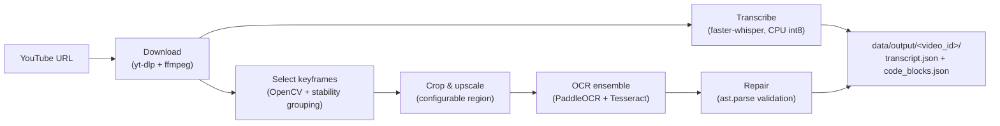

# ytextract

<p align="center">
  
  
  
  
  
</p>

**Local, CPU-only YouTube tutorial code extractor: given a video URL, produce a
timestamped transcript of the audio and the code shown on screen, saved to disk
as JSON.**

A personal productivity tool for anyone who wants to "watch" a coding tutorial
as text: the transcript for what was said, and near-verbatim code blocks for
what appeared on screen — without ever uploading anything. No YouTube Data API:
media access goes through `yt-dlp` only, and everything runs offline once the
video is downloaded.

## Install

Requires Python 3.10+, plus `ffmpeg` and `tesseract` on your `PATH` (the OCR
engines: `yt-dlp` and Whisper are installed via pip; PaddleOCR downloads its
models on first use).

```powershell
python -m venv .venv
.venv\Scripts\python.exe -m pip install -r requirements.txt
.venv\Scripts\python.exe -m pip install -e . --no-deps   # adds the `ytextract` command
```

Never activate the venv in scripts (PowerShell execution policy can silently
block `Activate.ps1`) — call the venv interpreter directly.

## Usage

```powershell
.venv\Scripts\python.exe -m ytextract <youtube-url>
# or, after the editable install:
ytextract <youtube-url>
```

The pipeline runs one video at a time: download → transcribe → keyframes →
crop → OCR → repair → store. Results land in `data/output/<video_id>/`
(`transcript.json` + `code_blocks.json`); downloaded media stays in
`data/raw/<video_id>/`.

Configuration is environment-driven (`YTEXTRACT_` prefix, optional `.env` — see
`.env.example`). The levers that matter most:

| Variable | Default | What it controls |
| --- | --- | --- |
| `YTEXTRACT_CROP` | *(none)* | `x,y,width,height` crop region — the main code-accuracy lever; point it at the code pane |
| `YTEXTRACT_WHISPER_MODEL_SIZE` | `tiny` | Whisper model (`tiny`/`base`/…); smaller = faster on CPU |
| `YTEXTRACT_SAMPLE_RATE_FPS` | `0.5` | frames per second sampled for keyframes |
| `YTEXTRACT_LOG_LEVEL` | `INFO` | logging verbosity |

### Output

`transcript.json` — timestamped speech:

```json
{
  "video_id": "aDWDJrACs7s",
  "title": "Build This $2800 Forex Trading Bot From Scratch (Full Code) \u2013 Part 2",
  "uploader": "Mr. CapFree",
  "language": "en",
  "segments": [
    { "start": 0.0, "end": 5.28, "text": " We're building the trading robot. It's a multi-currency grid..." }
  ]
}
```

`code_blocks.json` — one block per stable on-screen run, with validation status
(text truncated with `…`; this is a real block — the full-frame OCR noise is
exactly why `YTEXTRACT_CROP` matters):

```json
{
  "video_id": "aDWDJrACs7s",
  "blocks": [
    {
      "timestamp": 1700.0,
      "text": "View\nBuild\nDebug\nIools\n…",
      "language": "python",
      "source": "paddle+tesseract",
      "valid": false,
      "issues": [{ "line": 21, "message": "unmatched '}' (line 21, column 4)" }]
    }
  ]
}
```

## How it works


```mermaid
flowchart LR
  A["YouTube URL"] --> B["Download<br/>(yt-dlp + ffmpeg)"]
  B --> C["Transcribe<br/>(faster-whisper, CPU int8)"]
  B --> D["Select keyframes<br/>(OpenCV + stability grouping)"]
  D --> E["Crop & upscale<br/>(configurable region)"]
  E --> F["OCR ensemble<br/>(PaddleOCR + Tesseract)"]
  F --> G["Repair<br/>(ast.parse validation)"]
  C --> H["data/output/&lt;video_id&gt;/<br/>transcript.json + code_blocks.json"]
  G --> H
```

- **Download** — `yt-dlp` merges the best H.264 ≤1080p stream (AV1 excluded:
  OpenCV can't decode it) with audio; `ffmpeg` extracts 16 kHz mono PCM.
- **Transcript** — faster-whisper on CPU with int8 quantization; model size,
  device, language are all configurable.
- **Keyframes** — frames are sampled at a configurable rate and grouped into
  "stable runs" by a similarity metric; the last frame of each run is kept, so
  a code block that stays on screen yields exactly one OCR pass.
- **OCR** — PaddleOCR (primary) + Tesseract (secondary) behind one interface;
  results are merged (every primary line kept, high-confidence unmatched
  secondary lines added) and engines fall back if one fails.
- **Repair** — OCR'd text is validated with `ast.parse`; failures are reported
  with line numbers. Python is the built-in validator; more languages plug in
  via a registry.
- **Storage** — a repository-style interface writes one folder per video.

Details, machine profile, dependency rationale and build history:
[ARCHITECTURE.md](ARCHITECTURE.md).

## Development

Coverage-gated test suite (mocked, no network, no real binaries):

```powershell
.venv\Scripts\python.exe -m pytest --cov=src --cov-report=term-missing --cov-fail-under=100
```

Manual integration tests (real OCR / real Whisper on synthetic media) are
marked `integration` and excluded from the default run:

```powershell
.venv\Scripts\python.exe -m pytest -m integration -o addopts=""
```

Lint/format: `ruff check src tests` and `ruff format --check src tests`.

## Known limitations

- **Code accuracy depends on `YTEXTRACT_CROP`.** With no crop, full-frame OCR
  reads editor chrome (menus, status bars) instead of the code pane. Point the
  crop at the code region and real code lines come through at 67–96% confidence
  (verified on a live tutorial).
- **Validation is Python-only** (`repair.VALIDATORS`); tutorials in other
  languages (e.g. MQL5) are flagged as invalid by design.
- **CPU-only** — long videos transcribe slowly; keep the Whisper model small.
- **One video at a time**; batch processing is explicitly future work.
- **Windows-only code paths tested**; macOS/Linux are not covered.

## License

[MIT](LICENSE) © 2026 DeanT-04
